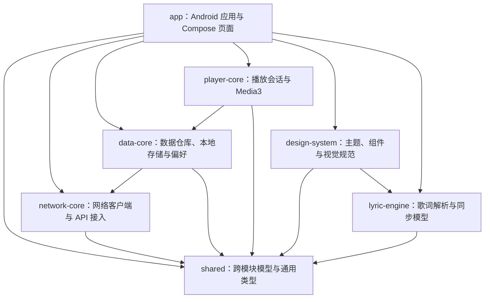

# 云声 Android 客户端：架构与源码说明

本文说明仓库中公开的源码布局、模块边界和构建入口。项目采用 Kotlin、Android Gradle Plugin、Jetpack Compose 与 Gradle 多模块结构。

## 模块关系



## 模块职责

| 模块 | 主要职责 |
| --- | --- |
| `app` | Android 应用入口、导航、页面与功能组合；定义 `min` / `full` 产品风味和设备 APK 构建配置。 |
| `shared` | Kotlin Multiplatform 通用模型、序列化类型和跨模块基础能力，提供 Android 与 JVM source set。 |
| `network-core` | 网络传输及服务 API 接入，基于 Ktor / OkHttp。 |
| `data-core` | 数据仓库与持久化，使用 Room、DataStore，并组合网络层。 |
| `player-core` | 音频播放会话和 Media3 播放器集成。 |
| `lyric-engine` | 歌词数据处理与解析能力。 |
| `design-system` | Compose 主题、可复用视觉组件和界面基础样式。 |

模块之间的 Gradle 依赖以各模块 `build.gradle.kts` 为准；上图概括主要依赖方向。

## 仓库顶层

- `settings.gradle.kts`：Gradle 模块注册。
- `build.gradle.kts`、`gradle/`：插件、依赖版本目录与 Wrapper 配置。
- `gradle.properties`：构建与 Kotlin/Android 工程属性。
- `app/src/`：Android manifest、Compose 页面、资源和应用级测试。
- 各库模块的 `src/`：各自的 Kotlin 实现和测试。
- `tools/`：项目资源处理辅助脚本。

本仓库已排除本地 SDK 路径、构建缓存、浏览器会话、内部诊断文档，以及原始个人截图、完整 OCR 输出夹具及直接读取这些夹具的专用回归测试。需要本地 SDK 的机器应自行配置 `local.properties`，不要将其提交到版本控制。

## 设备包配置

当前 `0.2.42` 分发附件是 Full Debug arm64-v8a APK：

- application id：`com.litemusic.app.full.debug`
- `minSdk`：28；`compileSdk` / `targetSdk`：36
- 版本代码：242；版本名称：0.2.42
- ABI：arm64-v8a
- 使用 Android debug 签名，仅供测试分发

构建命令：

```powershell
.\gradlew.bat :app:assembleFullDebug
```

要求 JDK 17 和 Android SDK 36。源码配置了 Min 风味，但本仓库只发布 Full arm64 安装包，不发布 Min 或 x86 APK。

## 离线播放与版本更新

`player-core/StreamAudioCache` 以进程内单例管理 Media3 音频缓存，使用 `NoOpCacheEvictor`，保存在 `noBackupFilesDir/stream-audio-v1`。`StreamCacheStorage` 在启动时尝试整目录迁移旧缓存，避免丢失已有索引；完整缓存状态用于离线选曲和灰显。部分缓存不保证能离线播放，音频缓存不等同于导出到公共音乐目录的下载文件。

`app/feature/update` 提供 GitHub Release 筛选、公开 API / 页面回退、下载进度、完整性检查与安装包身份检查。网络客户端不携带音乐账号 Cookie。每次下载使用独立临时文件，并把取消绑定到完整响应体读取；失败或取消会清理本次文件。`UpdateDownloadCoordinator` 由应用级作用域持有，离开设置页面后下载继续；`UpdateDownloadStore` 保存完成状态，应用重开后重新验证已有安装包，未完成任务从头重试，并防止重复下载。安装仅通过限定 `cache/updates/` 的 FileProvider 交给系统完成。

更新检查以 versionCode 为准，过滤预发布及不匹配附件，禁止降级。安装前核对包名、版本码和签名；APK 命名约定为 `Yunsheng-full-v版本-vc版本号-arm64-v8a.apk`，Release 标签沿用 `v版本`。

## 授权返回与账号验证

`app/feature/auth` 保留第三方官网登录页面及其 Cookie 会话。QQ 授权返回只接受受限的 HTTPS 返回入口，并绑定到发起该授权的内存会话：会话有效期为 5 分钟，匹配的返回只能消费一次。返回本身不表示登录成功，应用仍使用原页面的 Cookie 会话调用官方账号接口验证登录结果。Android 需要由用户允许云声处理 `ssl.ptlogin2.qq.com` 链接；其余账号方式继续使用官网网页流程，不能据此推断均支持自动回跳。

## 0.2.42 功能入口

- `app/feature/auth`：QQ 官方页面授权、受限 HTTPS 返回入口、同会话 5 分钟绑定与一次消费；最终账号状态仍由官方账号接口验证。

0.2.41 的以下功能继续保留：

- `app/feature/player/SleepTimerSheet.kt`：小时／分钟吸附滚轮、同排快捷设置及倒计时卡片；`SleepTimerUiPolicy.kt` 负责显示换算，`player-core/SleepTimerController.kt` 负责播放服务定时策略。
- `player-core/StreamAudioCache.kt`：缓存完整性与音频占用统计；`data-core` 的离线歌单存储为断网目录提供持久记录。
- `app/feature/playlist`：歌单搜索、显示排序、改名／简介、成员选择与移除；`SongActionSheet` 提供单曲收藏入口。
- `app/feature/playlist/importing`：来源解析、截图识别与匹配、账号草稿及写入检查点。草稿保存恢复状态，写入时核对成员，避免重复添加。
- `app/feature/update`：正式版本筛选、应用级下载状态、已完成包恢复校验和中文错误提示；未完成任务重试不执行按字节续传。
- `design-system` 和播放器歌词区域：主题背景强度、推荐页配色与歌词进度跟随。

一般测试分布在各模块测试 source set。原始个人截图、完整 OCR 输出夹具和读取这些夹具的专用回归测试沿用既有排除规则；通用解析／匹配测试保留，可能使用公开曲名作为例子。因此公开仓库的测试数量与完整开发工作区不同。滚轮、触摸反馈与第三方授权回跳仍需实机验证。

## 许可说明

该仓库没有附带开源许可证，因此公开仓库本身不表示授予复制、修改、再分发或商用源码的许可。第三方库与资源仍受其各自许可证约束。
