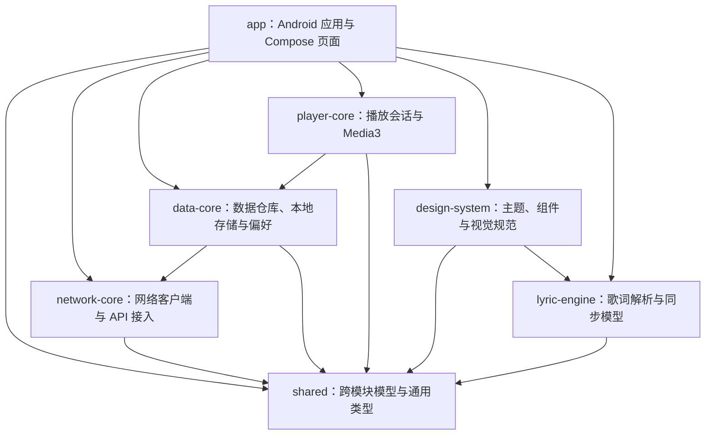

# 架构与源码说明

本文说明仓库中公开的源码布局、模块边界和构建入口。项目采用 Kotlin、Android Gradle Plugin、Jetpack Compose 与 Gradle 多模块结构。

## 模块关系



## 模块职责

| 模块 | 主要职责 |
| --- | --- |
| `app` | Android 应用入口、导航、页面与功能组合；定义 `min` / `full` 产品风味和设备 APK 构建配置。 |
| `shared` | Kotlin Multiplatform 通用模型、序列化类型和跨模块基础能力，提供 Android 与 JVM source set。 |
| `network-core` | 网络传输及服务 API 接入，基于 Ktor / OkHttp。 |
| `data-core` | 数据仓库与持久化，使用 Room、DataStore，并组合网络层。 |
| `player-core` | 音频播放会话和 Media3 播放器集成。 |
| `lyric-engine` | 歌词数据处理与解析能力。 |
| `design-system` | Compose 主题、可复用视觉组件和界面基础样式。 |

模块之间的 Gradle 依赖以各模块 `build.gradle.kts` 为准；上图概括主要依赖方向。

## 仓库顶层

- `settings.gradle.kts`：Gradle 模块注册。
- `build.gradle.kts`、`gradle/`：插件、依赖版本目录与 Wrapper 配置。
- `gradle.properties`：构建与 Kotlin/Android 工程属性。
- `app/src/`：Android manifest、Compose 页面、资源和应用级测试。
- 各库模块的 `src/`：各自的 Kotlin 实现和测试。
- `tools/`：项目资源处理辅助脚本。

本仓库已排除本地 SDK 路径、构建缓存、浏览器会话、内部诊断文档，以及包含个人歌单截图识别内容的专用测试夹具。需要本地 SDK 的机器应自行配置 `local.properties`，不要将其提交到版本控制。

## 设备包配置

当前发布附件是 `0.2.28` Full Debug arm64-v8a APK：

- application id：`com.litemusic.app.full.debug`
- `minSdk`：28；`compileSdk` / `targetSdk`：36
- 版本代码：228；版本名称：0.2.28
- ABI：arm64-v8a
- 使用 Android debug 签名，仅供测试分发

构建命令：

```powershell
.\gradlew.bat :app:assembleFullDebug
```

要求 JDK 17 和 Android SDK 36。源码配置了 Min 风味，但本仓库只发布 Full arm64 安装包，不发布 Min 或 x86 APK。

## 许可说明

该仓库没有附带开源许可证，因此公开仓库本身不表示授予复制、修改、再分发或商用源码的许可。第三方库与资源仍受其各自许可证约束。
